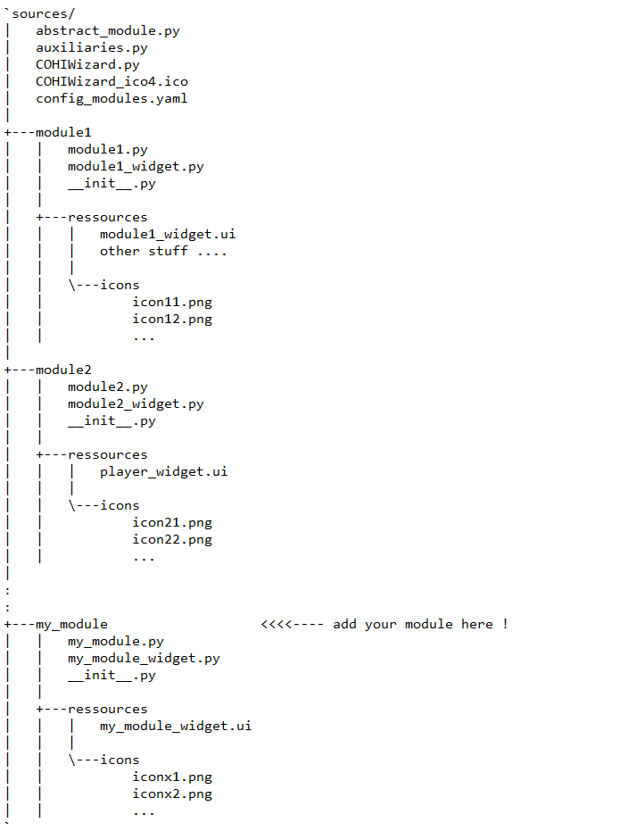

# How to add a new tab(module)

## extend the file structure

(1) create a new subfolder /my_module and /my_module/ressources as subdirectories of ~/sources. Optionally create a new subfolder /my_module/icons as subdirectories of ~/sources if pngs, svg's are to be used. 

The folder /my_module will be populate with files 'my_module.py' and 'my_module_widget.py' as shown in the next sections. /my_module/ressources may be populated with an ui-File 'my_module_widget.ui', which can be created with QTdesigner, as shown in a later section. In that case the 'my_module_widget.py' file is created with the pyuic - method.

For illustration the basic directory tree is shown plus the added module. 'module1', 'module2' represent already existing modules like 'player', 'resampler', ...:

## Creating the PyQT widget `my_module_widget.py`

**Method 1: writing from scratch**

move to /my_module and create a file `my_module_widget.py` containing the following structure:

	from PyQt5 import QtCore, QtGui, QtWidgets
	
	class Ui_my_module_widget(object):
    	  def setupUi(self, my_module_widget):
		  your code

**Method 2: using QTDesigner**

1. Create a new object of the class 'Widget'

2. Name the widget (ObjectName) 'my_module_widget', my_module standing for the name of your new module and set windowTitle to "My_Title"

3. Add a grid layout and name it ‘gridlayout_'my_module'.

3. Add all needed GUI elements and subwidgets to the gridlayout and name their ObjectNames appropriately

4. set horisontal/vertical size policy to 'minimum' in most items, sometimes to 'maximum', only exceptionally to fixed  (--> resizeable)

5. Convert the ui-File to a py-script typing `pyuic# -x ~/sources/my_module/ressources/my_module_widget.ui -o ~/sources/my_module/my_module_widget.py`

'#' here stands for the PyQT version you are using (e.g. 5, 6)

## write your new module `my_module.py`

For that purpose a template module 'abstract_module.py' is available in the ~/source folder.

1. Modify a copy of the abstract module `abstract_module.py` to `my_module.py`

`my_module.py` must contain the classes

	`my_module_m` (model)
	`my_module_c` (controller)
	`my_module_v` (view)

So replace the names of respective template classes 'abstract_module_#' to 'my_module_#', # = m, c, v.
Keep the 

2. Write your code

3. Access other modules by standard signalling and the standard self.m["..."] items provided via core as well as the rxhandler rxh(self)

	Detailed explanation: coming soon

4. OPTIONAL: in my_module_v(self), if wanted, add new canvas for embedding plots:

* add method:
    	
		def canvasbuild(self,gui):
		  self.cref = auxi.generate_canvas(self,self.gui.my_module_gridlayout,[row_index, col_index, line_span, col_span],[trow_index, tcol_index, tline_span, tcol_span],gui)

	
For plotting into this canvas reference all 'ax' and 'canvas' operations to self.cref: self.cref["ax"], self.cref["canvas"]

		[row_index, col_index, line_span, col_span]: coordinates and extension of the plot canvas
		[trow_index, tcol_index, tline_span, tcol_span]: coordinates and extension of the canvas toolbar, if wanted
		if trow < 0 --> no toolbar is being assigned

## connect your new module with the core module by editing the file 'config_modules.yaml'. Add your module-name so that the file looks like this:

`modules:
  player: playrec
  spectralviewer: view_spectra
  resampler: resample
  wavheader_editor: wavheader_editor
  yaml_editor: yaml_editor
  annotator: annotate
  synthesizer: synthesizer
  my_module: my_module    <<<<<<--- add this

module_names:
  player: Player
  spectralviewer: View Spectra
  resampler: Resampler
  wavheader_editor: Wavheader Editor
  yaml_editor: Yaml Editor
  annotator: Annotator
  synthesizer: Synthesizer
  my_module: NameofmyModule   <<<<<<--- add this`

'NameofmyModule' will appear as the text in the new GUI-Tab and in the list of tabs in the startup configuration menu.
If you wish to inactivate some modules, just comment them out with '#'. DO NOT COMMENT OUT OR REMOVE the first entry 'player'. This will let your system crash, because it refers to the core module.

5.	If you use ‘QFileDialog.getExistingDirectory ‘ for dialogues handled by your module you have to write:

`QFileDialog.getExistingDirectory(self.m["QTMAINWINDOWparent"], "Please chose source file directory")`

## Standard Directory tree:

sources/
|   abstract_module.py
|   auxiliaries.py
|   COHIWizard.py
|   COHIWizard_ico4.ico
|   config_modules.yaml
|   config_wizard.yaml
|
+---annotator
|   |   annotate.py
|   |   annotator_widget.py
|   |   __init__.py
|   |   
|   +---ressources
|   |   |   annotator_widget.ui
|   |   |   MWList_Pacific_Newzealand_et_environment.xlsx
|   |   |   MWLIST_USA.xlsx
|   |   |   MWLIST_Volltabelle.xlsx
|   |   |   MWLIST_Volltabelle_newzealand_used_for_Holme.xlsx
|   |   |   MWLIST_Volltabelle_old.xlsx
|   |   |   
|   |   \---icons
|
+---player
|   |   player_widget.py
|   |   playrec.py
|   |   stemlab_control.py
|   |   __init__.py
|   |   
|   +---ressources
|   |   |   player_widget.ui
|   |   |   
|   |   \---icons
|   |           Button_Playlist_Activate.png
|   |           Button_Playlist_Select.png
|   |           ff_v4.PNG
|   |           Logofield_rec2.png
|   |           loopactive_v4.png
|   |           loop_v4.png
|   |           pause_v4.PNG
|   |           play_v4.PNG
|   |           rec_v4.PNG
|   |           rew_v4.PNG
|   |           stop_v4.PNG
|   |           Trackingicon.png
|
+---resampler
|   |   resample.py
|   |   resampler_widget.py
|   |   set_fonts.py
|   |   __init__.py
|   |   
|   +---ressources
|   |   |   resampler_widget.ui
|   |   |   
|   |   \---icons
|           
+---spectralviewer
|   |   spectralviewer_widget.py
|   |   view_spectra.py
|   |   __init__.py
|   |   
|   +---ressources
|   |   |   spectralviewer_widget.ui
|   |   |   
|   |   \---icons
|           
+---synthesizer
|   |   synthesizer.py
|   |   synthesizer_widget.py
|   |   __init__.py
|   |   
|   +---ressources
|   |       synthesizer_widget.ui
|           
+---wavheader_editor
|   |   wavheader_editor.py
|   |   wavheader_editor_widget.py
|   |   __init__.py
|   |   
|   +---ressources
|   |   |   wavheader_editor_widget.ui
|   |   |   
|   |   \---icons
|           
+---yaml_editor
|   |   yaml_editor.py
|   |   yaml_editor_widget.py
|   |   __init__.py
|   |   
|   +---ressources
|   |   |   yaml_editor_widget.ui
|   |   |   
|   |   \---icons
          

